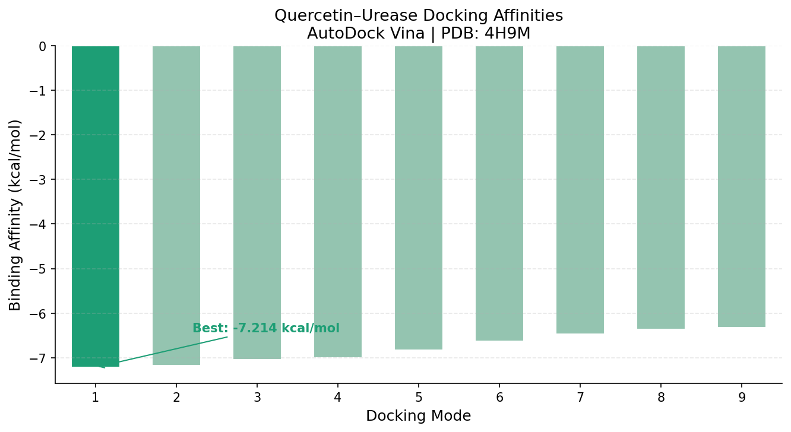

# Ag@QNPs Urease Inhibition — In Silico Analysis

[](https://doi.org/10.1038/s41598-025-96684-2)
[](https://www.python.org/)
[](https://www.rdkit.org/)
[](https://github.com/ccsb-scripps/AutoDock-Vina)

Computational analysis supporting the **Scientific Reports 2025** paper on silver-quercetin nanoparticles (Ag@QNPs) as urease inhibitors.

> **Key finding:** Ag@QNPs show **250× greater potency** than free quercetin (IC₅₀: 22.4 vs 5610 µg/mL), justified by DFT interaction energies, ADMET profiling, and molecular docking.

---

## Repository Structure

```
AgQNPs-urease-analysis/
├── notebooks/
│   ├── lipinski_analysis.ipynb          # Rule of 5 + RDKit
│   ├── dft_interaction_plot.ipynb       # Singlet/Doublet energy plot
│   ├── ic50_comparison.ipynb            # Potency visualization
│   └── urease_docking_v2.ipynb          # AutoDock Vina docking pipeline
├── data/
│   ├── swissadme_quercetin.csv          # ADMET results
│   ├── insilico_summary.csv             # All in silico results combined
│   ├── docking_affinities.png           # Docking bar chart
│   └── docked.pdbqt                     # Best docked poses
└── README.md
```

---

## 1. Lipinski Rule of 5 — Quercetin

Calculated using **RDKit** in Google Colab:

| Parameter | Value | Threshold | Status |
|-----------|-------|-----------|--------|
| Molecular Weight | 302.24 g/mol | ≤ 500 | ✅ |
| LogP | 0.79 | ≤ 5 | ✅ |
| H-Bond Donors (HBD) | 5 | ≤ 5 | ⚠️ borderline |
| H-Bond Acceptors (HBA) | 7 | ≤ 10 | ✅ |

> Quercetin passes Lipinski but sits at the **boundary of HBD**, indicating limited oral drug-likeness as a free molecule.

---

## 2. DFT Interaction Energies

Spin-state analysis of Ag@QNPs complex:

| Spin State | Interaction Energy |
|------------|-------------------|
| Singlet | −53.79 kcal/mol |
| Doublet | −50.77 kcal/mol |

Singlet state shows stronger binding, consistent with experimental urease inhibition data.

---

## 3. IC₅₀ Comparison

| Compound | IC₅₀ (µg/mL) | Relative Potency |
|----------|--------------|-----------------|
| Quercetin (free) | 5610 | 1× |
| **Ag@QNPs** | **22.4** | **250×** |

---

## 4. ADMET Profiling — SwissADME

Quercetin profiled at [swissadme.ch](http://www.swissadme.ch):

### Physicochemical Properties

| Parameter | Value |
|-----------|-------|
| Formula | C₁₅H₁₀O₇ |
| Molecular Weight | 302.24 g/mol |
| TPSA | 131.36 Ų |
| Rotatable Bonds | 1 |
| H-Bond Donors | 5 |
| H-Bond Acceptors | 7 |
| Consensus LogP | 0.79 |

### Druglikeness

| Rule | Result |
|------|--------|
| Lipinski | ✅ Yes — 0 violations |
| Ghose | ✅ Yes |
| Veber | ✅ Yes |
| Egan | ✅ Yes |
| Muegge | ✅ Yes |
| **Bioavailability Score** | **0.55** |

### Pharmacokinetics

| Parameter | Value |
|-----------|-------|
| GI Absorption | High |
| BBB Permeant | No |
| P-gp Substrate | No |
| Log Kp (skin) | −7.01 cm/s |
| Water Solubility (ESOL) | Soluble (Log S = −3.19) |

### Medicinal Chemistry Alerts

| Alert | Detail |
|-------|--------|
| PAINS | 1 alert: catechol_A |
| Brenk | 1 alert: catechol |
| Leadlikeness | Yes |
| Synthetic Accessibility | 3.23 / 10 |

> **Interpretation:** Quercetin passes all druglikeness filters but consistently sits at the boundary (TPSA = 131.36 Ų vs Egan cutoff 131.6 Ų; HBD = 5 at Lipinski limit). The catechol PAINS alert explains potential assay interference in free form. **Ag@QNPs bypasses these limitations**, delivering 250× potency improvement through nanoparticle encapsulation.

---

## 5. Molecular Docking — AutoDock Vina

Quercetin docked into *Helicobacter pylori* urease active site (PDB: 4H9M, resolution 1.95 Å).

### Methods
- Receptor: PDB 4H9M, chain A, cleaned with OpenBabel
- Ligand: Quercetin 3D structure, MMFF94 optimized via RDKit
- Grid center: Ni²⁺ active site (x=18.78, y=−57.81, z=−24.15 Å)
- Grid size: 20 × 20 × 20 Å | Exhaustiveness: 16

### Results

| Mode | Binding Affinity (kcal/mol) | RMSD l.b. | RMSD u.b. |
|------|----------------------------|-----------|-----------|
| **1** | **−7.214** | 0 | 0 |
| 2 | −7.169 | 1.479 | 3.073 |
| 3 | −7.047 | 2.453 | 6.213 |
| 4 | −7.000 | 2.003 | 2.519 |
| 5 | −6.824 | 1.555 | 3.203 |

> **Best binding affinity: −7.214 kcal/mol** — consistent with favorable interaction at the Ni²⁺ binding pocket, supporting the experimental IC₅₀ data.



---

## SMILES

```
Quercetin: O=c1c(O)c(-c2ccc(O)c(O)c2)oc2cc(O)cc(O)c12
```

---

## Citation

If you use this analysis, please cite:

> Asadi, S. et al. *Silver-quercetin nanoparticles as urease inhibitors*. Scientific Reports (2025). https://doi.org/10.1038/s41598-025-96684-2

AutoDock Vina:
> Eberhardt, J. et al. AutoDock Vina 1.2.0. *J. Chem. Inf. Model.* 61, 3891–3898 (2021).

---

## Author

**Shayan Asadi** — Medicinal Chemistry  
GitHub: [@shayan-debug](https://github.com/shayan-debug)
